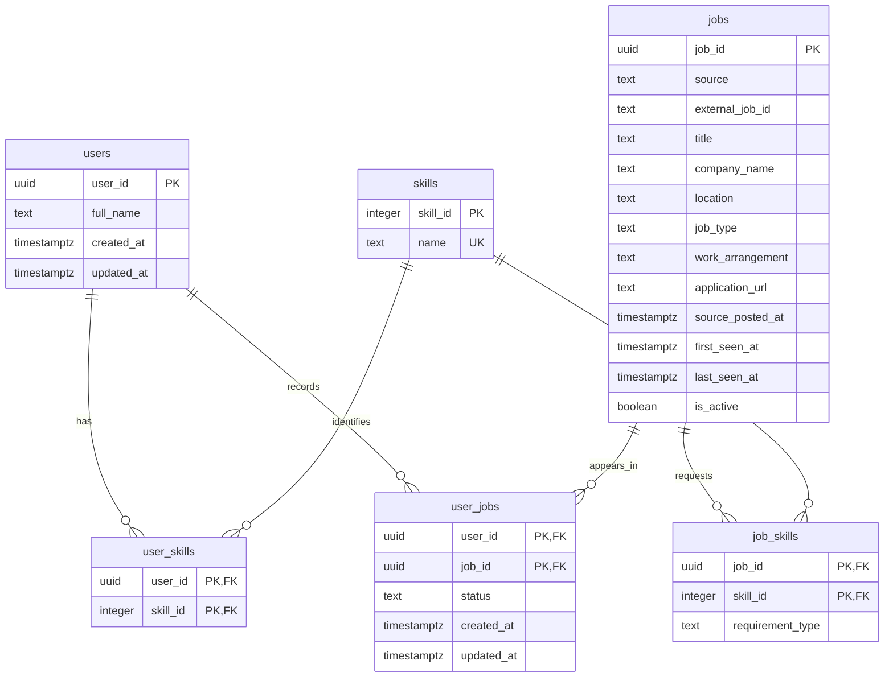

# MVP data model

Provisional, approved discussion baseline as of 9 September 2026. No migrations have
been applied. Revisit constraints and schema as the course progresses.

The runnable Supabase bootstrap is [DB/001_initial_schema.sql](DB/001_initial_schema.sql).
See [DB/README.md](DB/README.md) for application instructions and verification limits.

## PostgreSQL

| Table | Fields and types | Keys and rules |
|---|---|---|
| users | user_id UUID; full_name text; created_at timestamptz; updated_at timestamptz | PK user_id; FK to auth.users.id; all required. Google sign-in through Supabase Auth. |
| skills | skill_id integer; name text | Generated PK skill_id; required name, case-insensitive unique. Synonyms need application normalization. |
| user_skills | user_id UUID; skill_id integer | Composite PK (user_id, skill_id); FKs to users and skills. Both required. |
| jobs | job_id UUID; source text; external_job_id text; title text; company_name text; location text; job_type text; work_arrangement text; application_url text; source_posted_at timestamptz; first_seen_at timestamptz; last_seen_at timestamptz; is_active boolean | PK job_id; unique (source, external_job_id). location, job_type, work_arrangement and source_posted_at may be null; other fields required. is_active defaults true. |
| job_skills | job_id UUID; skill_id integer; requirement_type text | Composite PK (job_id, skill_id); FKs to jobs and skills; all required. requirement_type is REQUIRED or PREFERRED. |
| user_jobs | user_id UUID; job_id UUID; status text; created_at timestamptz; updated_at timestamptz | Composite PK (user_id, job_id); FKs to users and jobs; all required. |

job_type: FULL_TIME, PART_TIME, INTERNSHIP. An internship is INTERNSHIP even if full-time.
work_arrangement: ONSITE, HYBRID, REMOTE.
user_jobs.status: NOT_INTERESTED, SAVED, APPLIED, INTERVIEW, REJECTED, OFFER.

created_at/first_seen_at are creation timestamps; updated_at/last_seen_at must be maintained
by application writes (or a later agreed trigger). A default timestamp alone does not update itself.

The junction tables implement users↔skills, jobs↔skills and users↔jobs many-to-many
relationships. Each link references exactly one existing row on either side. A parent
can have zero or many links. The bootstrap uses ON DELETE RESTRICT for every FK;
account deletion and cross-database cleanup flows remain to be designed.

## MongoDB

Bootstrap: [DB/001_initial_collections.js](DB/001_initial_collections.js), run in mongosh.
See [DB/README.md](DB/README.md#mongodb) for BSON types and application responsibilities.

### resume_documents

| Field | Type | Rule/purpose |
|---|---|---|
| _id | ObjectId | Document primary key |
| user_id | String UUID | Unique; logical reference to SQL users.user_id |
| file_name | String | Original filename only; not a downloadable file reference |
| raw_text | String | Extracted resume text |
| extracted_data | Object | skills array; education, experience and projects arrays of objects |
| uploaded_at | Date | Current upload timestamp |

A user has zero or one current document. A new upload replaces it. Extracted skills are
suggestions; confirmed edits live in SQL user_skills. No history or original PDF retention.

### job_documents

| Field | Type | Rule/purpose |
|---|---|---|
| _id | ObjectId | Document primary key |
| job_id | String UUID | Unique; logical reference to SQL jobs.job_id |
| raw_jd | String | Original description text |
| extracted_data | Object | role_category string; requirements array; responsibilities string array |
| extracted_at | Date | Current extraction timestamp |

Each normalized requirement contains skill_id (SQL integer reference), requirement_type
(REQUIRED/PREFERRED), minimum_years (number or null) and evidence (JD wording).
The LLM extracts names/evidence; application normalization assigns actual skill IDs.
Do not infer missing years or silently force ambiguous requirement strength; agree an
unknown/validation policy before extraction implementation.

A job has zero or one document during ingestion and exactly one current document when
ready for matching. The application must manage readiness and recovery; ordinary MongoDB
references do not enforce SQL foreign keys or a transaction spanning both databases.

Proposed role-gap query: obtain relevant active job IDs from SQL, aggregate their MongoDB
requirements by canonical skill, then compare with the student's confirmed SQL skill IDs.
Count a skill once per eligible job; expose the denominator. This avoids copying active
status into documents just to support filtering. Reassess if dataset size changes.

## Rules tied to product behaviour

- Every saved or not-interested decision has one user_jobs row; any such row excludes
  the listing from that user's discovery feed. No requeue and no separate swipes table.
- Browser batching affects request timing, not this relational structure. Latest-decision
  ordering, retries and account isolation need implementation-level tests.
- (source, external_job_id) prevents repeated imports from one provider; it does not solve
  cross-provider duplicates or reposts using new IDs.
- An absent job in one API page is not evidence of closure.
- Match scores are user-dependent; do not put a global score on jobs.
- Google sign-in through Supabase Auth is agreed. All application-data access goes
  through Python. Token verification, deletion flows and cross-store recovery remain
  implementation work before real student data is accepted.
